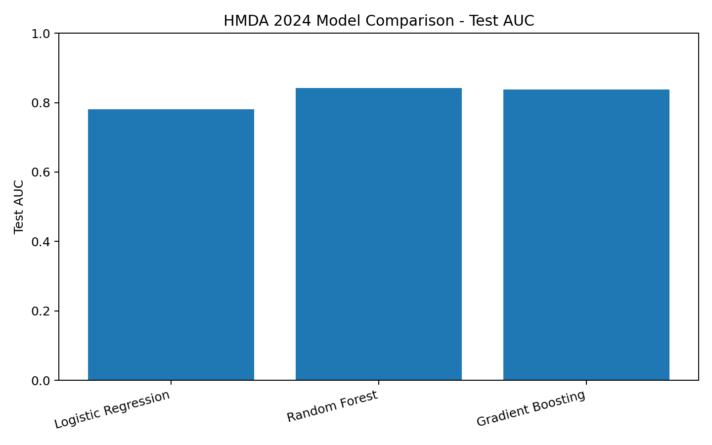
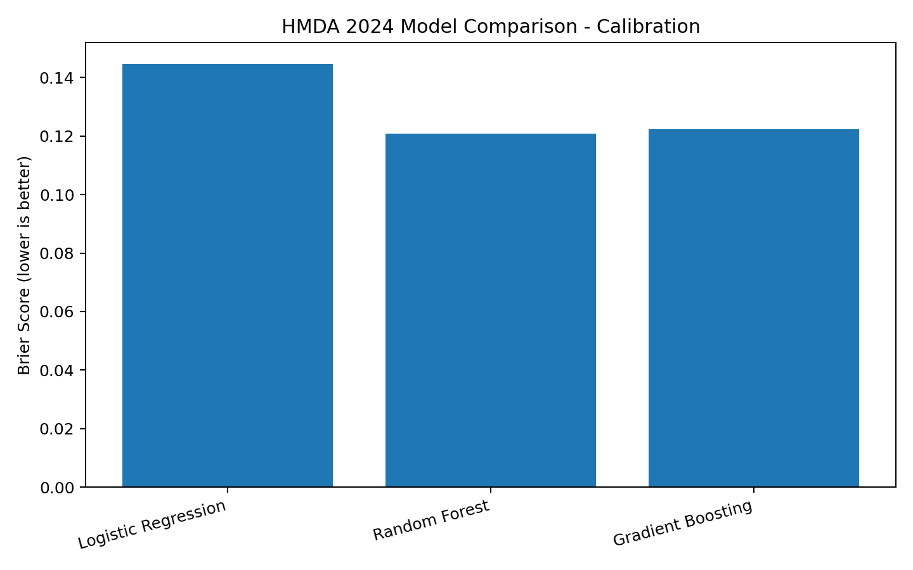
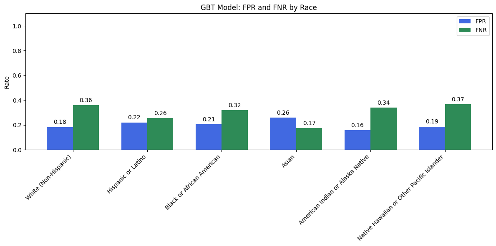
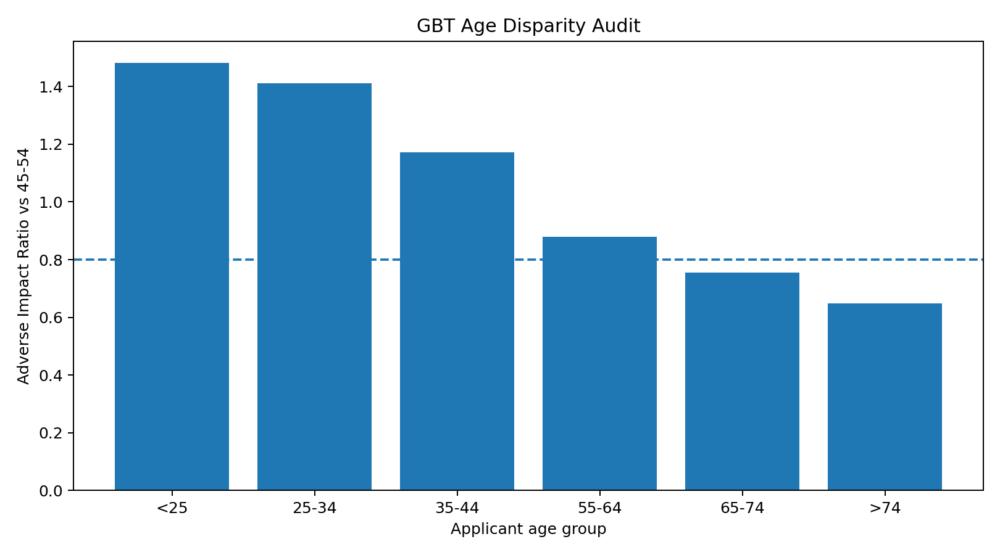
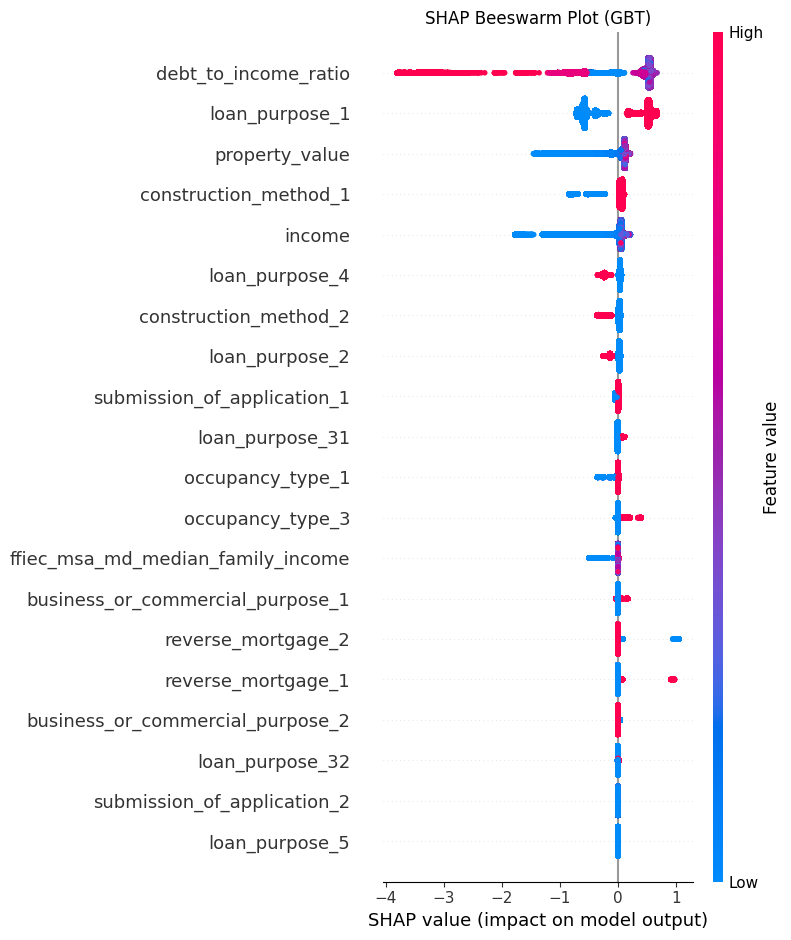
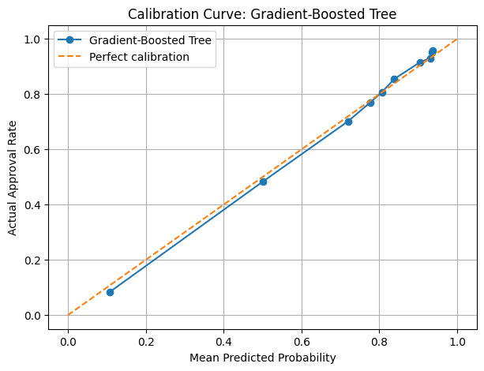
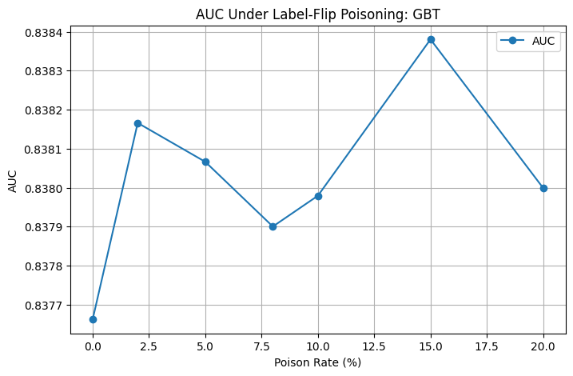

# Responsible Machine Learning Audit: HMDA 2024 Mortgage Approval Models

**Fairness · Explainability · Robustness · ML Security · Model Governance**

This portfolio project audits mortgage approval prediction models built from the **2024 HMDA Loan Application Register**. The objective is not only to compare predictive performance, but to evaluate whether a model is **fair, explainable, robust, secure, monitorable, and defensible for deployment**.

This work originated as the ** Capstone project for DNSC 6330: Responsible Machine Learning at George Washington University (May 2026)**.

## Why this project matters

Mortgage approval is a high-stakes decision context. A model can perform well overall while still creating uneven errors across applicant groups, relying on problematic proxies, degrading under drift, or remaining vulnerable to data / security failures.

The audit therefore asks five governance questions:

1. What is the model optimizing for?
2. Where is the model expected to fail?
3. Are errors or favorable outcomes uneven across subgroups?
4. What risks remain after mitigation?
5. Is deployment defensible, and under what conditions?

## Dataset

The source notebooks begin with the 2024 HMDA Loan Application Register and produce a cleaned modeling dataset of **3,962,464 applications**. The modeled outcome is binary:

- `action_taken` 1 or 2 -> approved (`1`)
- `action_taken` 3 -> denied (`0`)
- other action codes are excluded

The cleaned source run reports an overall approval rate of approximately **74.41%**.

Protected / sensitive audit attributes such as race, sex, applicant age, and state are retained for subgroup analysis but excluded from the predictive feature matrix in the saved notebooks.

## Models evaluated

| Model | Test Accuracy @ 0.80 | Test AUC | Brier Score | AUC Train-Test Gap |
|---|---:|---:|---:|---:|
| Logistic Regression | 0.6699 | 0.7812 | 0.1447 | -0.0003 |
| Random Forest | 0.6898 | **0.8426** | **0.1209** | 0.0008 |
| Gradient Boosting | **0.7080** | 0.8377 | 0.1224 | 0.0006 |





### Model-selection interpretation

The source team retained **Gradient Boosting (GBT)** as the audit model because it provided strong discrimination and calibration while supporting the source project's fairness / governance tradeoff analysis.

Importantly, the saved source outputs show that **Random Forest has slightly higher test AUC and a slightly lower Brier score than GBT**. The portfolio therefore does **not** claim that GBT wins every predictive metric.

Also, the three notebooks were executed independently and the saved subgroup test counts differ slightly across runs. Cross-model subgroup comparisons should therefore be treated as approximate rather than as a perfectly controlled same-holdout benchmark. See [`PORTFOLIO_NOTES.md`](PORTFOLIO_NOTES.md).

## Fairness and subgroup audit

The GBT notebook evaluates race, sex, age, state, and intersectional groups using metrics including:

- Adverse Impact Ratio (AIR)
- Standardized Mean Difference (SMD)
- False Positive Rate (FPR)
- False Negative Rate (FNR)
- subgroup AUC and calibration

### Race

For the saved GBT run, Black applicants have an approval-rate AIR of approximately **0.945 vs White applicants**, while Black FPR is **0.2056** versus **0.1836** for White applicants.



The race audit is therefore not summarized by AIR alone: the source results show that favorable-rate screening and error-rate parity can tell different stories.

### Age

Using applicants aged 45-54 as the reference group, the saved GBT source run reports:

- age 65-74: AIR **0.7544**
- age >74: AIR **0.6481**



The intersectional source analysis also reports:

- `>74 Female` AIR: **0.623** vs `45-54 Male`
- `>74 American Indian or Alaska Native` AIR: **0.490** vs `45-54 White (Non-Hispanic)`

These findings are treated as audit flags requiring deeper compliance / governance review rather than as legal conclusions.

## Explainability

The project uses **LIME** for local explanations, **SHAP** for global / local feature attribution, and **DiCE** for counterfactual analysis.



A recurring source finding is the importance of **debt-to-income ratio (DTI)**. For the lowest-scored GBT examples, high DTI is one of the strongest negative contributors to approval probability. The project also examines whether geographic / neighborhood variables can function as proxy-risk signals requiring governance scrutiny.

## Robustness and drift

The saved GBT run reports:

- train-test AUC gap: **0.0006**
- Brier score: **0.1224**
- PSI = **0.0** for the key train/test feature checks in the source notebook
- score PSI = **0.0** in the train/test comparison



These checks indicate stable behavior inside the source 2024 train/test experiment, but they do **not** establish future real-world stability. The portfolio treats post-2024 concept drift as a forward-looking monitoring risk.

## ML security audit

The project tests three attack / privacy scenarios:

### 1. Input gaming / evasion

Bounded perturbations to income and DTI shift approval probabilities and produce prediction flips, showing that the decision surface can be sensitive to manipulated inputs.

### 2. Label-flip poisoning

At a **5% label-flip rate** targeted at Black-applicant training labels, the saved GBT run changes overall AUC by only **+0.0004**, while subgroup approval behavior shifts more materially.



This is a strong governance lesson: aggregate AUC monitoring alone may fail to detect subgroup-level harm from poisoned labels.

### 3. Membership inference

The source confidence-based membership inference test reports AUC approximately **0.500**, indicating no detectable train/test membership separation in that experiment.

## Monitoring framework

The source audit defines concrete post-deployment triggers:

| Area | Metric | Alert trigger | Frequency |
|---|---|---|---|
| Fairness | AIR by race and sex | AIR < 0.80 or > 1.25 | Monthly |
| Fairness | FPR disparity by race | gap > 5 percentage points | Monthly |
| Performance | Test AUC and log loss | AUC drops > 2 percentage points | Monthly |
| Calibration | Brier score by subgroup | subgroup Brier > 0.20 | Quarterly |
| Drift | PSI on income, DTI, property value | PSI > 0.25 | Monthly |
| Security | Subgroup FPR post-retrain | >10% shift from prior | Each retrain |

The source presentation recommends **conditional deployment with active monitoring**, subject to unresolved age-disparity review, data-access controls, and threshold validation.

## Repository structure

```text
hmda-responsible-ml-audit/
├── README.md
├── PORTFOLIO_NOTES.md
├── notebooks/
│   ├── 01_logistic_regression_baseline.ipynb
│   ├── 02_random_forest_challenger.ipynb
│   └── 03_gradient_boosting_selected_model.ipynb
├── images/
├── results/
├── reports/
│   └── audit_summary.md
├── data/
│   ├── README.md
│   └── raw/
├── requirements.txt
└── .gitignore
```

## Reproduce locally

```bash
git clone https://github.com/FranbonAhmed/hmda-responsible-ml-audit.git
cd hmda-responsible-ml-audit
python -m venv .venv
pip install -r requirements.txt
jupyter notebook
```

Open the notebooks in numerical order. The data setup cell will look for an extracted HMDA `.txt` file in `data/raw/`; if none is present, it uses the shared source-data download configured in the original team notebooks.

## Team / authorship note

This was a Group team capstone. This portfolio repository preserves and refactors the group analysis for professional presentation; it does not claim sole authorship of every modeling, fairness, security, or governance component.

## Responsible-use note

This repository is an academic Responsible ML audit. It is **not a production credit-decision system**, legal opinion, or lending recommendation.
